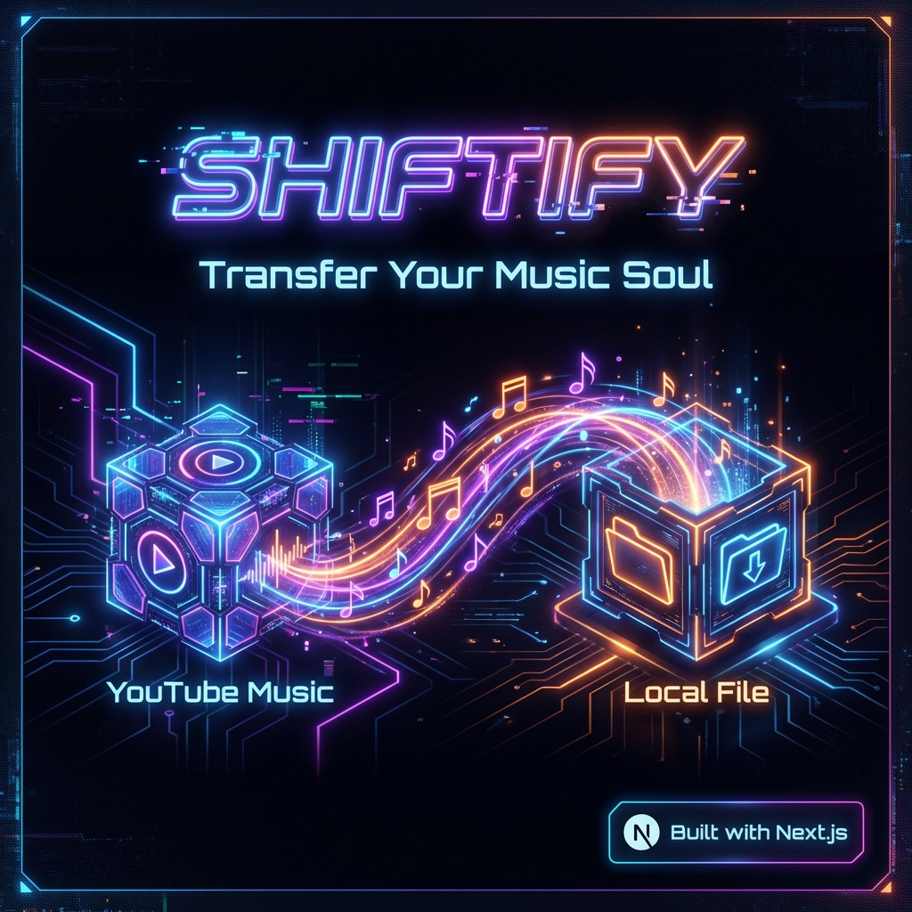
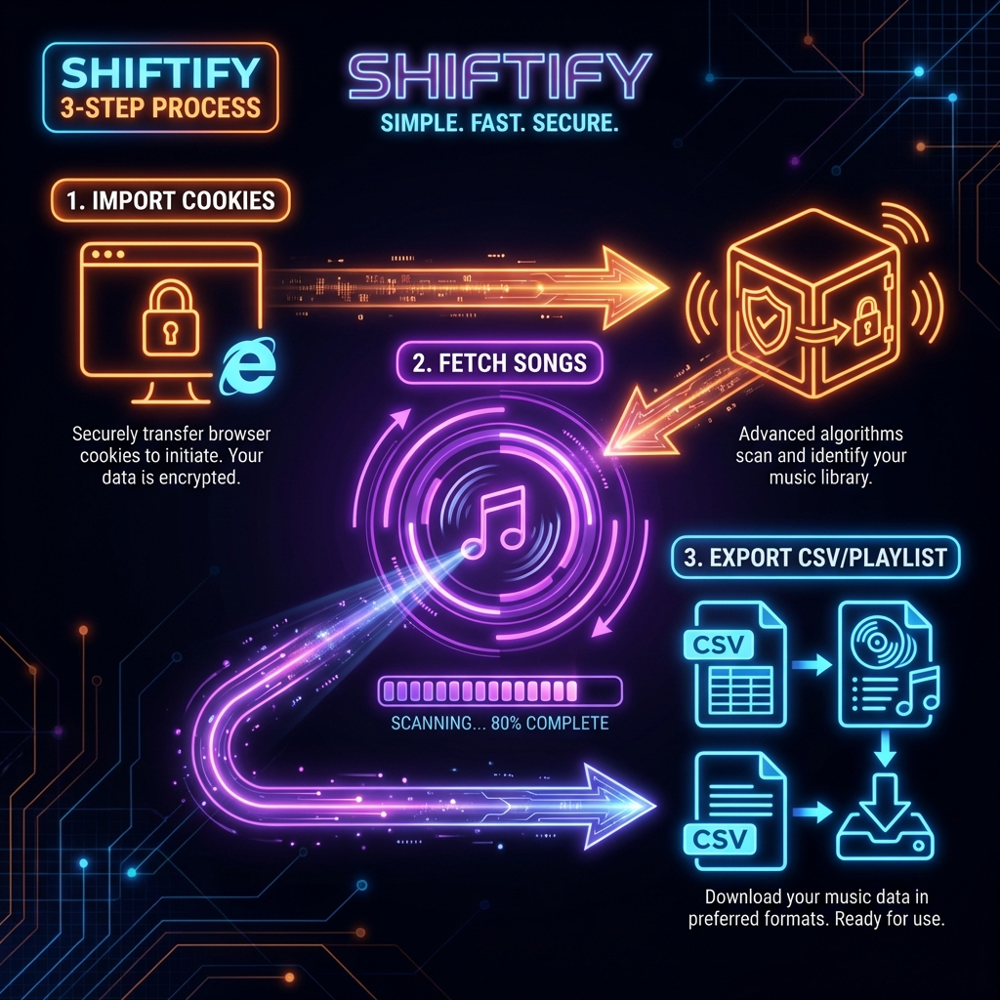

<div align="center">
  
  <h1>Shiftify</h1>
  <p>Premium, privacy-first music transfer studio.</p>
  <p>
    <a href="https://github.com/HuLaxx/Shiftify">GitHub</a>
  </p>
  <p>
    
    
    
    
    
  </p>
</div>

<p align="center">
  
</p>

## Overview
Shiftify helps you move your YouTube Music playlists and liked songs using a cookie-first flow. Everything runs locally with an on-device SQLite database, so your data stays on your machine.

## Highlights
- Cookie-based transfer wizard with progress, retries, and live logs
- Import formats: lines, CSV, and JSON
- Review queue with approve and reject controls
- Telemetry timeline for every transfer run
- CSV export for import reports
- Motion-first UI with page transitions, staggered reveals, and ambient backgrounds

## Motion Preview
<p align="center">
  
</p>

## UI Screens
<p align="center">
  
</p>

<p align="center">
  
</p>

## Quickstart
1. Clone the repo
   ```bash
   git clone https://github.com/HuLaxx/Shiftify.git
   cd Shiftify
   ```
2. Install dependencies
   ```bash
   npm install
   ```
3. Start the dev server
   ```bash
   npm run dev
   ```
4. Open `http://localhost:3000`

## Usage
1. Go to `/transfer` and connect your source account with cookies
2. Select a playlist or liked songs
3. Verify the destination account cookies
4. Start the transfer and monitor progress
5. Use `/runs` for logs and `/review` for import approvals

## Data and Privacy
- Local database: `data/shiftify.db`
- Cookies are used only in your browser session and never sent to a third-party server

## Optional Config
```bash
NEXT_PUBLIC_DEMO_MODE=true
```

## Project Structure
```
src/
  app/          Next.js App Router pages and APIs
  components/   UI primitives and layout pieces
  lib/          local DB and helpers
public/         static assets
data/           local SQLite storage
```

<details>
  <summary>Routes</summary>

  - `/` Home
  - `/transfer` Transfer flow
  - `/import` Import creator
  - `/review` Review queue
  - `/runs` Run telemetry
</details>

<details>
  <summary>API Endpoints</summary>

  - `POST /api/ytm` YouTube Music actions
  - `GET /api/imports` Import list
  - `POST /api/imports` Create import
  - `GET /api/imports/:id?include=items` Import items
  - `PATCH /api/imports/:id` Update item status
  - `GET /api/imports/:id/report` Export CSV report
  - `GET /api/runs` Run list
  - `POST /api/runs` Create run
  - `GET /api/runs/:id` Run details
  - `POST /api/runs/:id/events` Run events
</details>

## Scripts
```bash
npm run dev
npm run build
npm run start
npm run lint
```

## Contributing
1. Fork the repo
2. Create a branch: `git checkout -b feature/name`
3. Commit changes: `git commit -m "Add feature"`
4. Push: `git push origin feature/name`
5. Open a PR

## License
MIT
